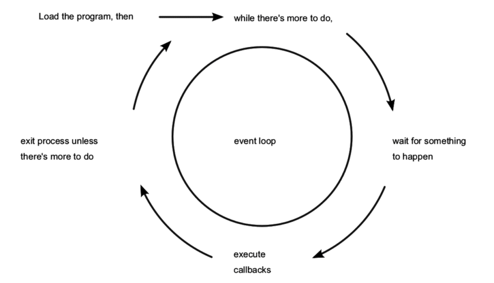

# what is node.js?

Node.js® is a JavaScript runtime built on Chrome's V8 JavaScript engine. Node.js uses an event-driven, non-blocking I/O model that makes it lightweight and efficient. Node.js' package ecosystem, npm, is the largest ecosystem of open source libraries in the world.

# how to install

# npm

"An old programming adage says that while functionality is an asset, code is a liability."

# eventloop so How Node.js Applications Work

Node.js couples JavaScript with an event loop for quickly dispatching operations when events occur.Node.js’s philosophy is to give you low-level access to the event loop and to system resources. Or, in the words of core committer Felix Geisendörfer, in Node.js “everything runs in parallel except your code.”[ 13] If this seems a little backward to you, don’t worry. The following figure shows how the event loop works.



As long as there’s something left to do, Node.js’s event loop will keep spinning. Whenever an event occurs, Node.js invokes any callbacks (event handlers) that are listening for that event. As a Node.js developer, your job is to create the callback functions that get executed in response to events. Any number of callbacks can respond to any event, but only one callback function will ever be executing at any time. Everything else your program might do— like waiting for data from a file or an incoming HTTP request— is handled by Node.js, in parallel, behind the scenes. Your application code will never be executed at the same time as anything else. It will always have the full attention of Node.js’s JavaScript engine while it’s running.

exaplain: gmail, getting new emails vs typing email

`exrx: while-timeout`

notice: there is no sleep in JavaScript. And don't trust timeouts

# semicolons

# arrow functions

- more concise
- allow implicit returns
- get 'this' from parent function

```javascript
function powerTwo(a) {
  return a * a
}

let powerTwo = a => a * a
```

# spread operator

```javascript
const languages = ['javascript', 'python', 'php']
const dsl = ['SQL', 'CSS', 'HTML']
const allLanguages = [...languages, ...dsl]

Math.max(...[-1, 100, 9001, -32]) // 9001
```

### spread with strings

```javascript
function wrapInAsterisks(word) {
  return [...word].map(letter => `*${letters}*`).join('')
}

console.log(wrapInAsterisks('THURA'))
```

### mutate object with spread

```javascript
const initState = {
  name: 'Fox Reymann',
  nationality: 'Polish'
}

// correct
const state = {...initialState, height: 184}

// wrong
const state = initialState // this will create new variable referring to the same object
state.height = 184 // mutation
```

# rest operator

# TDD

https://github.com/foxreymann/es6-exercise

# callback vs promises / async await

exrx: read-file.js
callback

exrx: add-files.js
callback hell
save in a file - add 2 numbers and substract third one - add values, store output in file 3
cons: globals and multiple requests
cons: promise.all

exrx: read-file-promise.js

exrx: add-files-promise.js

exrx: read-file-async.js

exrx: add-files-async.js

# non blocking i/o

exrx: non-blocking-io

download files from an array of url's to a directory. do it one by one, measure time. next do it async, so all at once

# why javascript?

runs in every webbrowser in the world

runs server side
Many middleware tasks are I/ O-bound, just like client-side scripting and databases. These server-side programs often have to wait for things like a database result, feedback from a third-party web service, or incoming connection requests. Node.js is designed for exactly these kinds of applications.

On the left, back-end databases are investing heavily in JavaScript. Document-oriented databases like MongoDB and CouchDB use JavaScript extensively— from modifying records to ad-hoc queries and mapreduce jobs. Other NoSQL datastores, like Elasticsearch and Neo4j, present data in JavaScript Object Notation (JSON). These days, you can even write SQL functions for Postgres in JavaScript with the right plugin.

Node.js has also made inroads into the field of autonomous systems. Platforms for protyping the Internet of Things, such as the Raspberry Pi OS Raspbian, come with Node.js, and Tessel is built on Node.js from the ground up.

Johnny-Five and CylonJS are two robotics-development platforms that help you develop Node.js applications for a variety of hardware components.

# types

So let’s begin at the basics. There are 5 different literal (things you can declare instantaneously) types that exist in JS:

### Numbers

```javascript
1
2
1.28
NaN
Infinity
-Infinity
```
(not a number) is a number. From the ECMA spec:

> 4.3.20 Number type: set of all possible Number values including the special
> “Not-a-Number” (NaN) values, positive infinity, and negative infinity

```javascript
typeof 2
typeof Infinity
typeof NaN
```

### Strings **(e.g. `'xyz'` , `"abc"`) Pretty straightforward

primitive

```javascript
'abc'
"abc"
'abc' + "abc"
```

### Template literals

string with backticks

```javascript
`abc`

`abs
 ced`

let name = 'Fox'
`my name is ${name}.`
```


### Boolean** (just `true` and `false`)…there’s a whole article that can be
written about truthy vs falsy values. But for the moment, we’re going to skip
that.

**Objects** (e.g. `{name:'abhi', dob: '1997'}`)

While objects are just an unordered map from string keys to values, arrays are an ordered list of values with integer keys.


**Array **(e.g. `[1,2,'hi']`)
let arr = [1,2,3]

arr[0] = 4

console.log(arr)

let last = arr.pop()

console.log(Array.isArray(arr))

Of these literals, only booleans, numbers, and strings are primitives. There are
also a couple of other primitive values (`undefined` and `null`).

exrx: Given that the `typeof` function will output a string representing the type of a variable passed to it, what is `typeof([1,2,3])`? Well…it’s actually `'object'` .

In JavaScript, objects and arrays are handled nearly identically because arrays
are just instantiations of objects. The difference is the following:

* While objects are just an unordered map from string keys to values, arrays are
an ordered list of values with integer keys.

Keep that idea in mind, knowing that an array is really an object helps you gain
intuition for WAT is happening.

exrx: Array.isArray()


# be careful

```javascript
0.1 + 0.2
Math.PI
[] + [] =''
[] + {} = '[object Object]'
{} + [] = 0
{} + {} = NaN
'fox' + 1 / fox1
'fox' - 1 / NaN
Array(16).join('_' - 1) + ' Fox' = 'NaNNaNNaN Fox'

parseInt('09') // don't use
+'09'
parseInt('12a34') // don't use
+'12a34'

# == vs ===

# Scoping and hoisting

```exrx/scope-var-global.js```
